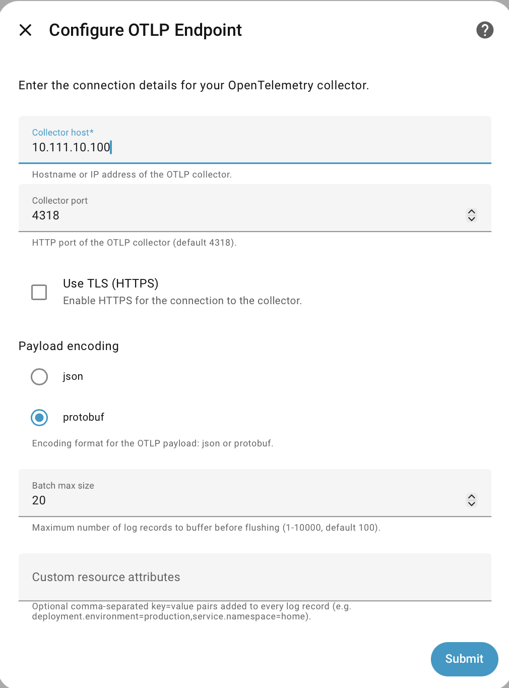
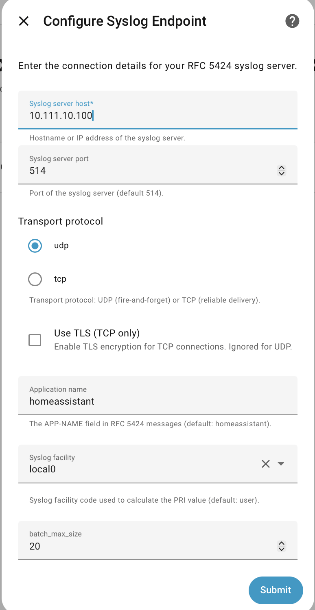

{ align=left }


# Home Assistant Remote Logger

[](https://github.com/rhizomatics) [![hacs][hacsbadge]][hacs]

[](https://github.com/rhizomatics/ha_remote_logger)
[](https://results.pre-commit.ci/latest/github/rhizomatics/ha_remote_logger/main)


[](https://github.com/rhizomatics/ha_remote_logger/actions/workflows/deploy.yml)
[](https://github.com/rhizomatics/ha_remote_logger/actions/workflows/github-code-scanning/codeql)
[](https://github.com/rhizomatics/ha_remote_logger/actions/workflows/dependabot/dependabot-updates)

<br/>
<br/>
<br/>


Listens to Home Assistant system log events and sends log events to a remotely
Syslog or OpenTelemetry collector.

Logs structure is preserved from the Home Assistant internal event, so multi-line logs and stacktraces are preserved as single log entries, unlike console scrapers which will create a log event per line, and will capture script names, line numbers and versions properly.

Only Home Assistant server itself, with its custom components is supported. Logs from *apps* (previously known as 'add-ins'), HAOS or the HA Supervisor aren't provided as events to be captured, so require an alternative solution, like [LogSpout](https://github.com/bertbaron/hassio-addons/tree/main/logspout) will cover these. It can be used in combination with *Remote Logger* so that Home Assistant has good structured logs, and everything else is at least logged.

## Installation

**Remote Logger** is a HACS component, so that has to be installed first, using the instructions
at [Getting Started with HACS](https://www.hacs.xyz/docs/use/).

The integration installs using the Home Assistant integrations page, and has no YAML configuration.

{width=400}

However, a YAML change is required to the Home Assistant [System Log](https://www.home-assistant.io/integrations/system_log/) integration, to enable event forwarding.

```yaml title="Home Assistant Configuration"
system_log:
    fire_event: true
```

## Open Telemetry (OTEL)

Logs are sent using Open Telemetry Logs specification over a [Open Telemetry Protocol](https://opentelemetry.io/docs/specs/otlp/)(OTLP) connection, either as Protobuf or JSON, and currently only as HTTP (gRPC may be added in future).

{width=500}

For more information, see [OpenTelemetry Logging](https://opentelemetry.io/docs/specs/otel/logs/).

Log records are collected and sent in a bundle

## Syslog

Messages are sent using the more recent [RFC5424](https://datatracker.ietf.org/doc/html/rfc5424) format, with additional structured data using OTEL taxonomy (see [Additional Attributes](#additional-attributes)).

Syslog can be sent as TCP or UDP.

{width=400}

## Additional Attributes

The following additional attributes, derived directly from the
Home Assistant log event, are provided as Syslog `STRUCTURED-DATA` attributes, or OTEL attributes.

* `code.file.path`
* `code.line.number`
* `code.function.name` (this is the `logger` value from Home Assistant)
* `exception.count`
* `exception.first_occurred`
* `exception.stacktrace`

OTEL taxonomy is used for both OTEL and Syslog since there's no standard taxonomy at this
level of Syslog.

## Log Servers

There are a zillion possible solutions for capturing, analyzing, aggregating and storing logs.

One combination that works well is using [Vector](https://vector.dev) and [GreptimeDb](https://greptime.com) - they are fast, lightweight, open source, customizable and run under Docker. Vector has support for OTEL logging, as well as Syslog, and has good remapping ability to fine tune each source. Its then easy to pull in logs from Docker servers, firewalls, Unifi switches or wherever else into one time-line, as well as server and network metrics.

[hacs]: https://hacs.xyz
[hacsbadge]: https://img.shields.io/badge/HACS-Default-blue.svg
