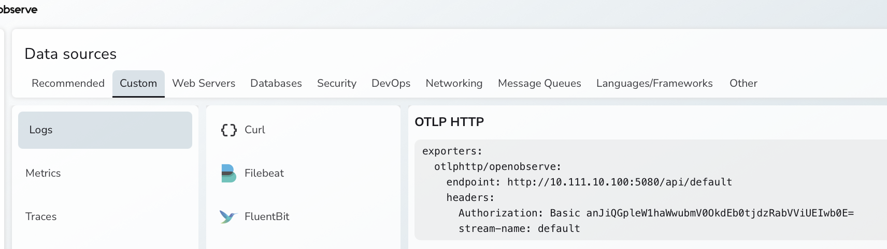
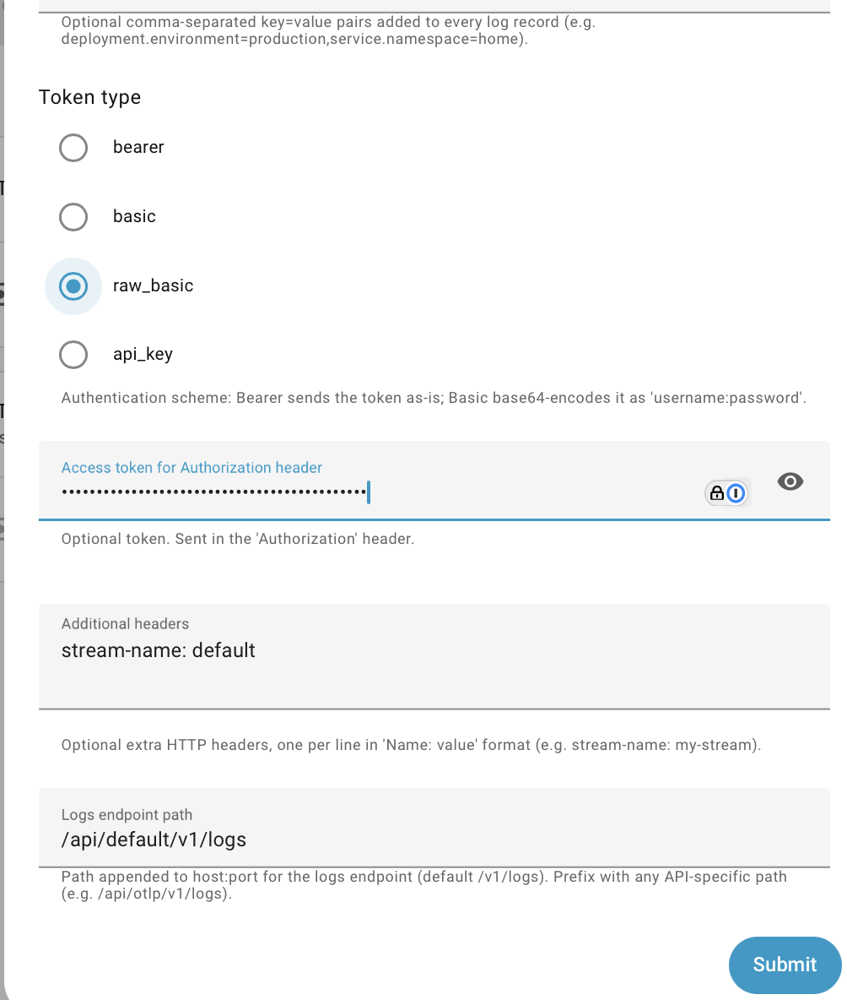

# Log Aggregators

There are many aggregators that will accept Syslog and OTLP (Otel Logging), some of which are open source, free for self-hosting and work well.

Some aggregators can directly consume remote logs, while others need an ingestion/transformation engine like Datadog's [Vector](https://vector.dev), [FluentD](https://www.fluentd.org) etc. These also allow logs to be pulled in, so events in HomeAssistant can be seen in the context of what's happening in HAOS Apps, docker containers, network switches, firewalls etc.

## OpenObserve

OO can accept Otel logging natively or via Vector, and now needs Vector for Syslog.

To configure the preferred OTLP logging, a few overrides are needed.

Use the built-in configuration generator in OpenObserve, as below:

{width=600}

OpenObserve has a non-default port, a non-default API end-point and needs additional headers.

*Remote Logger* has options to support all of these, as in this example:

{width=500}

Note that *Raw Basic* has been selected rather than *Basic* since the token provided by OpenObserve has already been encoded.

## GreptimeDB

Use Vector for ingestion, and no transforms are needed

```yaml
sources:
  otlp:
    type: opentelemetry
    http:
      address: 0.0.0.0:4318
    use_otlp_decoding: false
sinks:
  greptime:
    inputs:
      - "otlp.logs"
    type: "greptimedb_logs"
    endpoint: http://greptime:4000
    dbname: public
    compression: gzip
    table: logs
```
